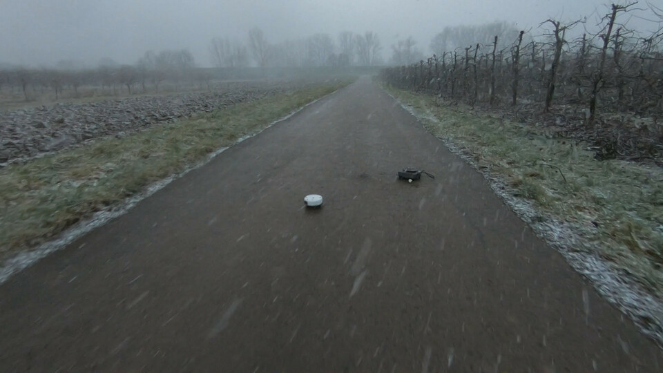
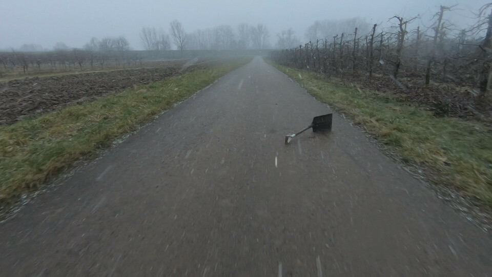
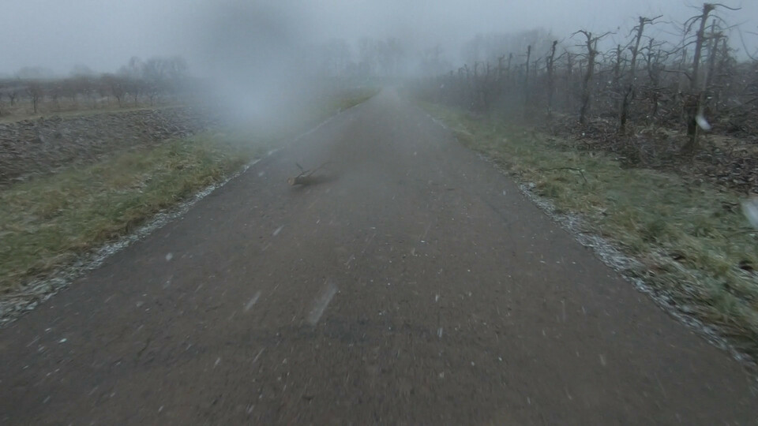
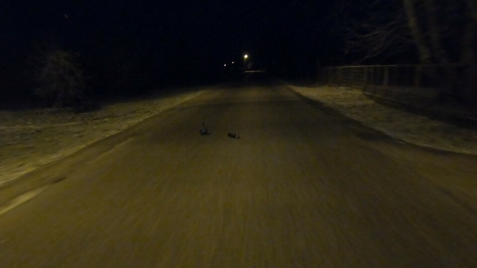
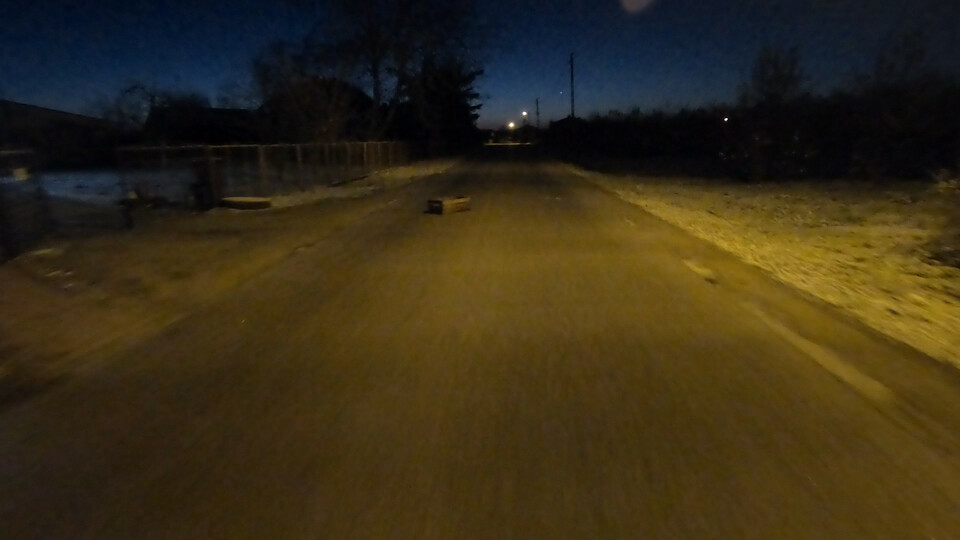
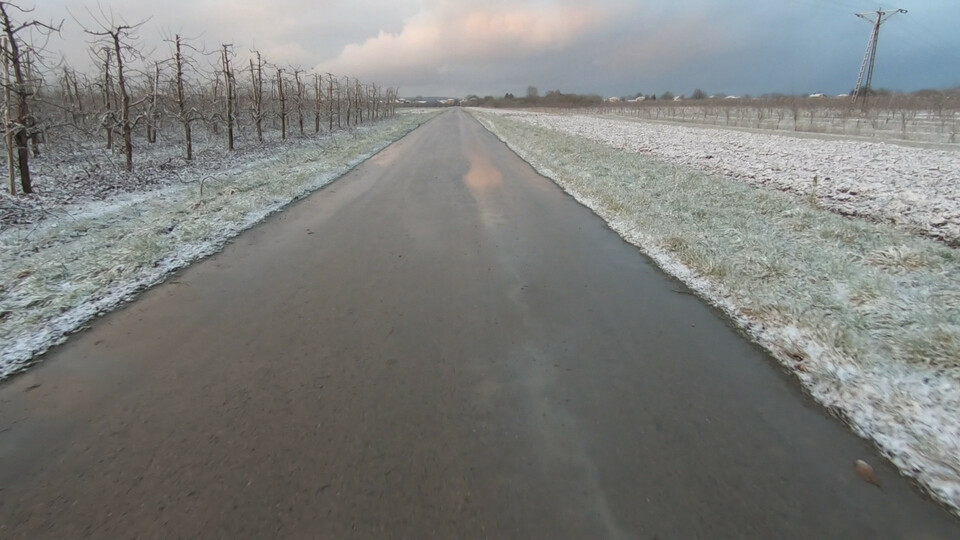
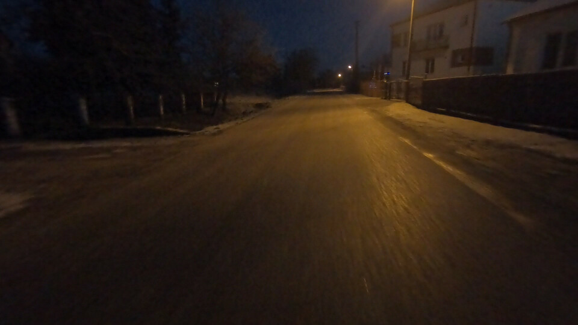

# Road Obstacles V2

### Source recordings

We have recorded videos of road scenes with obstacles.
The *Road Obstacles V2* features a new set of diverse obstacles, placed and recorded in two locations.

For this new set, we have recorded full video sequences made from a vehicle approaching the obstacle.
We approach each obstacle two times.

The sequences explore challengine circumstances rarely seen in existing datasets:

* snowstorm
* water drops on the camera sensor
* night, with street-laps

#### Location 1 - Snowstorm

<figure>
	
</figure>

#### Location 1 - Water on camera

<figure>
	
</figure>

#### Location 2 - Night

<figure>
	
</figure>

#### Empty road

We also collect sequences of empty road, as a test of false-positives or for training.

<figure>
	
</figure>
